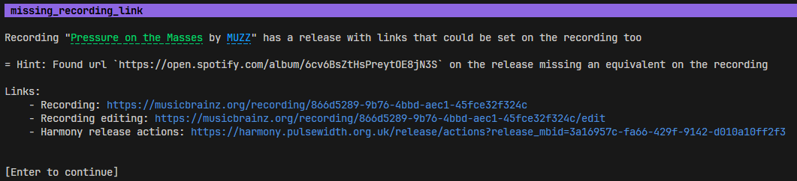

# Alistral

[](https://github.com/RustyNova016/alistral/actions/workflows/rust.yml)

A collection of CLI based tools for Listenbrainz.

# Installing

Check out the guide [here](https://rustynova016.github.io/Alistral/installing.html)

# Usage

The documentation book can be found [here](https://rustynova016.github.io/Alistral/)

Full markdown help can be found under [docs/CommandLineHelp.md](https://rustynova016.github.io/Alistral/CommandLineHelp.html), but full `--help` support exists too. 

# Featured Tools

Here's some of what Alistral can do:

## Daily

Gives a daily recap containing the latest releases, track birthdays and discovery anniversaries

[Read more](https://rustynova016.github.io/Alistral/daily.html) | [Usage](https://rustynova016.github.io/Alistral/CommandLineHelp.html#alistral-daily)

## Statistics

An extended statistic calculator that calculate fresh statistics in a blink
of an eye! (Data fetching not counted)
Supports a wider range of entities like releases, works, or even tags. 

[Read more](https://rustynova016.github.io/Alistral/stats/stats.html) | [Usage](https://rustynova016.github.io/Alistral/CommandLineHelp.html#alistral-stats)

## Musicbrainz Clippy

An utility to find errors, missing data, or other potential edits for musicbrainz.
It crawls over all the entities and do a series of checks called "lints", checking the integrity of the data.

This is similar to [the musicbrainz reports](https://musicbrainz.org/reports) but contains other lints and utilities to quickly fix them.

⚠️ All results are suggestions. Take them with a grain of salt. If you are unsure, it's preferable to skip.

[Read more](https://rustynova016.github.io/Alistral/clippy/clippy.html) | [Usage](https://rustynova016.github.io/Alistral/CommandLineHelp.html#alistral-musicbrainz-clippy)



## Radio

A few radio algorithms have been made to generate playlists for you

### Artist Circles

[Usage > Command Line documentation](https://rustynova016.github.io/Alistral/CommandLineHelp.html#alistral-radio-circles)

This algorithm keep your playlist close to the artists you are listening to. The way it generate is as follow:

- Get a random listen
- Get its artist
- Add a random recording made by this artist

There is the option to only get unlistened recordings, making an alternative to ListenBrainz's own discovery playlists.

### Underrated tracks

[Usage > Command Line documentation](https://rustynova016.github.io/Alistral/CommandLineHelp.html#alistral-radio-underrated)

This radio will create a playlist containing all the tracks that you listen to, but seemingly no one else does. 

### Listen rate

[Usage > Command Line documentation](https://rustynova016.github.io/Alistral/CommandLineHelp.html#alistral-radio-rate)

This algorithm bases itself on your listen rate of recording to get more forgotten tracks. It takes the recordings with the lowest listen rates, and put them into a playlist


# Shell completions:

How to use value hints and generate shell completions.

Usage with zsh:
```console
$ alistral --generate=zsh > /usr/local/share/zsh/site-functions/_alistral
$ compinit
```
fish:
```console
$ alistral --generate=fish > alistral.fish
$ . ./alistral.fish
```

# Other infos

This project is in beta. There's a lot of features I'd like to add, and need a lot of testing before 1.0. If you find a bug, or have a feature request, feel free to create (and spam) a new issue.

# See also
- [musicbrainz_rs](https://github.com/RustyNova016/musicbrainz_rs): API binding for Musicbrainz
- [listenbrainz-rs](https://github.com/InputUsername/listenbrainz-rs): API bindings for listenbrainz
