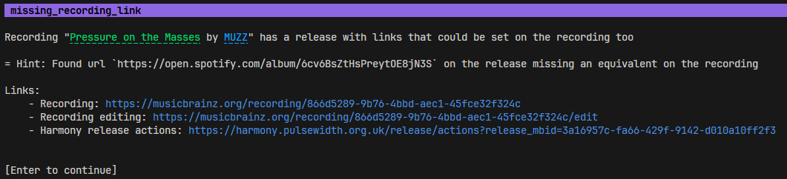

# `alistral musicbrainz clippy`

An utility to find errors, missing data, or other potential edits for musicbrainz.
It crawls over all the entities and do a series of checks called "lints", checking the integrity of the data.

This is similar to [the musicbrainz reports](https://musicbrainz.org/reports) but contains other lints and utilities to quickly fix them.

By default, the lints start from your listened recordings on Listenbrainz, but you can specify a recording to start from.

⚠️ All results are suggestions. Take them with a grain of salt. If you are unsure, it's preferable to skip.

[Available Lints](./lints.md)

[Usage](../CommandLineHelp.md#alistral-musicbrainz-clippy)